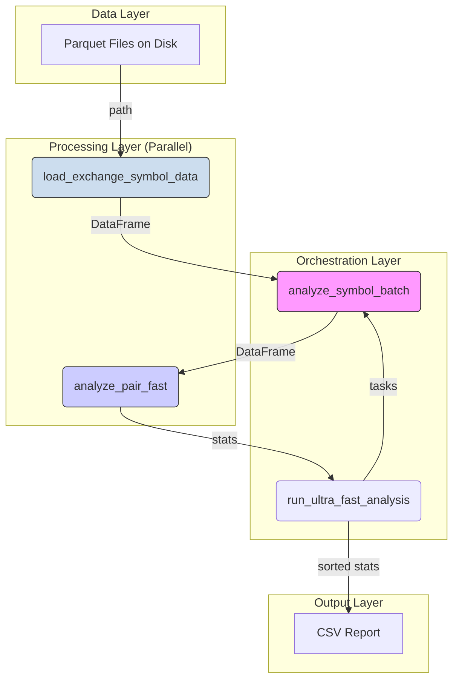

# Детальная архитектура проекта Analyzer

## 1. Обзор

Проект `analyzer` - это высокопроизводительное Python-приложение консольного типа, предназначенное для пакетного анализа рыночных данных с максимальной производительностью через параллельную обработку и эффективное управление данными в памяти. Приложение является stateless и управляется исключительно через аргументы командной строки.

**Ключевые характеристики:**
- Stateless архитектура без внешних зависимостей (БД, серверы)
- Массовая параллельная обработка через `multiprocessing.Pool`
- Оптимизированная работа с памятью через `polars`
- Конфигурация только через командную строку

## 2. Архитектурные слои и компоненты

Архитектура реализована как набор модулей в директории `lib/`, управляемых скриптом `run_all_ultra.py`.

### 2.1. Слой оркестрации (`run_ultra_fast_analysis`)

Главный компонент, управляющий всем процессом анализа.

**Файл:** [`run_all_ultra.py`](analyzer/run_all_ultra.py) и [`lib/analysis.py`](analyzer/lib/analysis.py)

**Ответственности:**
- Обнаружение доступных данных (`discover_data`)
- Фильтрация данных по датам и биржам
- Создание и распределение задач для параллельной обработки
- Агрегация результатов от воркеров
- Сохранение финального отчета в CSV

**Параллелизм:** `multiprocessing.Pool` для распределения задач по символам между процессами, максимальное использование CPU ядер.

**Ключевые оптимизации:**
- Балансировка нагрузки: автоматическое определение количества воркеров (3x CPU cores)
- Планировщик задач: чанкинг по символам для эффективного IPC

### 2.2. Слой пакетной обработки (`analyze_symbol_batch`)

Компонент для анализа всех пар бирж одного символа за один проход.

**Файл:** [`run_all_ultra.py:39`](analyzer/run_all_ultra.py:39)

**Ответственности:**
- Загрузка данных для одного символа со всех бирж
- Анализ всех возможных пар бирж для этого символа
- Возврат результатов анализа для всех пар

**Параллелизм:** `concurrent.futures.ThreadPoolExecutor` для параллельной загрузки данных с разных бирж (I/O-bound операция).

**Ключевая оптимизация (Баблинг по символу):**
Данные для одного символа (например, `BTC/USDT`) загружаются в память один раз и затем многократно используются для анализа всех пар (Bybit-Binance, Bybit-OKX, Binance-OKX, etc.). Это исключает избыточные дисковые I/O операции.

### 2.3. Слой доступа к данным (`load_exchange_symbol_data`)

Компонент чтения и предобработки данных с диска.

**Файл:** [`lib/data_loader.py`](analyzer/lib/data_loader.py)
 
 **Ответственности:**
 - Поиск корректного пути к данным символа с поддержкой разных форматов именования
 - Эффективная фильтрация файлов по датам *до* чтения
 - Чтение всех необходимых Parquet файлов одним проходом (`pl.scan_parquet`)
 - Базовая очистка и трансформация данных (выбор колонок, переименование, приведение типов, фильтрация null)
 
 **Технология:** `polars.scan_parquet` для ленивого чтения, что позволяет Polars движку оптимизировать запрос.
 
 **Поддерживаемые форматы символов (в порядке приоритета):**
 1. `symbol.replace('/', '_')` → `VIRTUAL_USDT` (Collections format)
 2. `symbol.replace('/', '#')` → `VIRTUAL#USDT` (Legacy)
 3. `symbol.replace('/', '').replace('_', '')` → `VIRTUALUSDT` (Fallback)

### 2.4. Слой анализа и вычислений (`analyze_pair_fast`)

Основное ядро системы, где происходит анализ одной пары бирж.

**Файл:** [`lib/analysis.py:45`](analyzer/lib/analysis.py:45)

**Ответственности:**
- Синхронизация временных рядов данных двух бирж
- Вычисление метрик отклонений, среднего реверсирования и торговых возможностей

**Технология:** В основном использует `polars` для всех вычислений для максимальной производительности. Алгоритм `count_complete_cycles` использует `numpy` конверсию для итеративной обработки - известная область для будущей оптимизации.

**Алгоритмы:**
- `join_asof`: Быстрая и эффективная синхронизация временных рядов
- Векторизованные операции `polars` для вычисления `ratio` и `deviation`
- Кастомный алгоритм `count_complete_cycles` (использует `numpy` цикл) для подсчета реалистичных торговых возможностей

**Критическая исправленная логика:** [`lib/analysis.py:108`](analyzer/lib/analysis.py:108)

Метрика `deviation` вычисляется от 1.0 (ценовое равенство), НЕ от среднего отношения. Это критически важно для арбитража - отклонение = 0 означает возможность закрытия позиции по безубытку.

## 3. Поток данных



1. **Источник:** Набор Parquet файлов на диске, структурированных по `exchange/symbol/date/hour`
2. **Загрузка:** `load_exchange_symbol_data` читает файлы и создает `polars.DataFrame` в памяти для каждой пары `(exchange, symbol)`
3. **Объединение:** `analyze_pair_fast` объединяет два `DataFrame` в один используя `join_asof`
4. **Трансформация:** Создаются новые колонки (`ratio`, `deviation`, флаги порогов)
5. **Агрегация:** Скалярные значения (статистики) извлекаются из `DataFrame` методами `.mean()`, `.max()`, `.sum()`
6. **Результат:** Статистики собираются в словарь, затем список словарей, финально конвертируются в `polars.DataFrame`
7. **Вывод:** Финальный `DataFrame` сохраняется в CSV файл

## 4. Критические оптимизации производительности

### 4.1. Оптимизация #8: Единое сканирование Parquet
**Файл:** [`lib/data_loader.py`](analyzer/lib/data_loader.py)

```python
# Было: множественные сканирования файлов
# Стало: один scan_parquet для всех файлов (2-4x быстрее I/O)
df = pl.scan_parquet(all_files)
```

### 4.2. Оптимизация #12: Параллельная загрузка бирж
**Файл:** [`run_all_ultra.py:48`](analyzer/run_all_ultra.py:48)

```python
# ThreadPoolExecutor для параллельной загрузки бирж (1.5-2x быстрее)
with ThreadPoolExecutor(max_workers=len(exchanges)) as executor:
    future_to_exchange = {
        executor.submit(load_exchange_symbol_data, ...): exchange
        for exchange in exchanges
    }
```

### 4.3. Оптимизация #4: Чистые Polars операции
**Файл:** [`lib/analysis.py:102`](analyzer/lib/analysis.py:102)

```python
# Векторизованные Polars операции (1.5-2x быстрее, zero-copy)
joined = joined.with_columns([
    (pl.col('bid_ex1') / pl.col('bid_ex2')).alias('ratio')
])
```

## 5. Конфигурация

Приложение полностью конфигурируется через аргументы командной строки с использованием `argparse`.

**Файл:** [`run_all_ultra.py:296`](analyzer/run_all_ultra.py:296)

**Параметры:**
- `--data-path`: Определяет корневой путь к хранилищу данных
- `--workers`: Позволяет настройку производительности через контроль количества процессов
- `--date`, `--start-date`, `--end-date`: Гибкость в выборе временного среза для анализа
- `--thresholds`: Позволяет настройку ключевых параметров алгоритма поиска возможностей
- `--exchanges`: Фильтрация по списку бирж
- `--today`: Алиас для анализа только сегодняшних данных

## 6. Алгоритмы подсчета циклов

### 6.1. Алгоритм полных циклов (`count_complete_cycles`)
**Файл:** [`lib/analysis.py:11`](analyzer/lib/analysis.py:11)

Критически важный алгоритм для подсчета реалистичных торговых возможностей.

**Логика:** Подсчитываются только ПОЛНЫЕ циклы:
- Движение от ~нуля → выше порога → возврат к ~нулю
- Это обеспечивает подсчет только торгуемых возможностей (можно закрыть позицию по безубытку)

**ZERO_THRESHOLD:** 0.05% (5 базисных пунктов) - допуск для шума при определении "нулевой" зоны.

### 6.2. Детекция пересечений нуля
**Файл:** [`lib/analysis.py:128`](analyzer/lib/analysis.py:128)

```python
# Исправленная логика: умножение для определения истинных смен знака
deviation_sign = pl.col('deviation').sign()
zero_crossings = int(
    joined.with_columns([
        (deviation_sign * deviation_sign.shift(1) < 0).alias('crossed')
    ])['crossed'].sum()
)
```

## 7. Архитектурные проблемы и известные ограничения

### 7.1. Известные узкие места
1. **NumPy зависимость в count_complete_cycles:** [`lib/analysis.py:11`](analyzer/lib/analysis.py:11) - требует конверсию в numpy для итеративной обработки
2. **Память:** Загрузка данных символа целиком в память может быть проблемой для больших символов
3. **IPC накладные расходы:** Передача больших DataFrame между процессами

### 7.2. Области для будущих оптимизаций
1. Реализация `count_complete_cycles` полностью на Polars
2. Добавление streaming/chunked обработки для больших датасетов
3. Кэширование результатов на диске для повторного анализа

## 8. Выходные метрики

Система генерирует следующие ключевые метрики:

**Основные метрики:**
- **Zero crossings per minute:** Частота среднего реверсирования
- **Opportunity cycles per hour:** Количество полных циклов для разных порогов (0.3%, 0.5%, 0.4%)
- **Percent time above threshold:** Процент времени выше каждого порога

**Дополнительные метрики:**
- **Deviation asymmetry:** Асимметрия отклонений (индикатор направленного уклона)
- **Pattern break detection:** Детекция неполных паттернов в конце данных
- **Average cycle duration:** Средняя длительность цикла в секундах

## 9. Заключение

Архитектура analyzer'а оптимизирована для максимальной производительности при анализе больших объемов рыночных данных. Stateless дизайн делает приложение легким в развертывании, а агрессивная параллелизация обеспечивает значительное ускорение анализа по сравнению с наивными реализациями.

**Ожидаемое ускорение:** 2-3x против предыдущей версии, 30-60x против наивной реализации.
