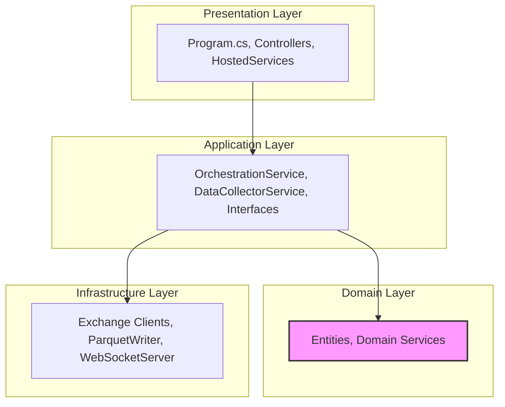
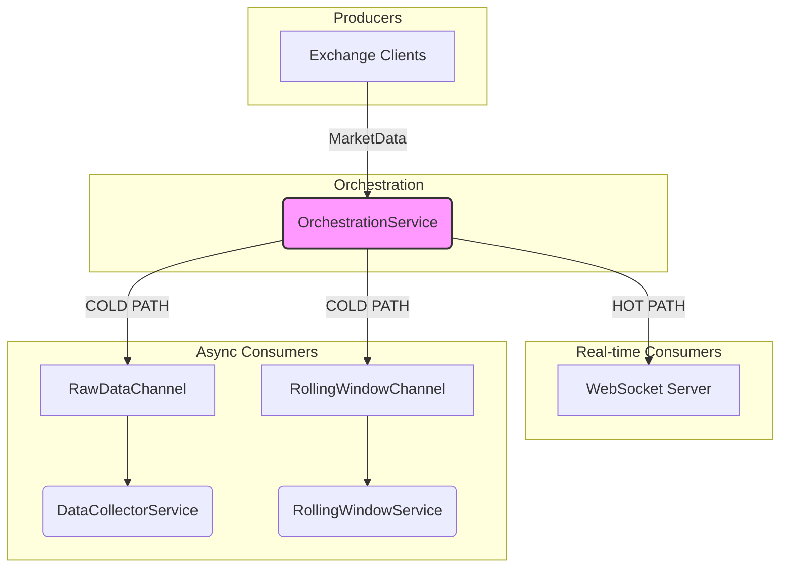

# Детальная архитектура проекта Collections (SpreadAggregator)

**Версия:** 2.0 (Обновлено на основе анализа кода: 2025-11-19)

## 1. Обзор

Проект `SpreadAggregator` (часть инициативы `collections`) - это высокопроизводительное .NET 8 приложение, разработанное с использованием Clean Architecture и event-driven принципов. Основная функция - агрегирование real-time рыночных данных с множественных криптобирж, расчет арбитражных спредов, трансляция через WebSocket сервер и сохранение всех данных в Parquet файлы для последующего анализа.

**Ключевые характеристики:**
- **Clean Architecture**: Строгое разделение ответственности между слоями
- **Event-driven**: Асинхронная обработка через `System.Threading.Channels`
- **HFT оптимизации**: `TryWrite` для minimal latency (~50-100ns)
- **Multi-exchange**: Поддержка 8 криптобирж одновременно
- **Zero-copy архитектура**: Минимальное выделение памяти в горячем пути

## 2. Архитектурные слои (Clean Architecture)

Проект строго следует принципам Clean Architecture с направлением зависимостей внутрь.



### 2.1. Domain Layer (`SpreadAggregator.Domain`)

**Ответственность:** Бизнес-логика независимая от реализации.

**Ключевые компоненты:**
- **`MarketData.cs`** - Сущность для данных рынка
- **`SpreadData.cs`** - Данные арбитражного спреда
- **`SpreadCalculator.cs`** - Расчет спредов
- **`VolumeFilter.cs`** - Фильтрация по объему

### 2.2. Application Layer (`SpreadAggregator.Application`)

**Ответственность:** Оркестрация доменной логики, определение *что* делать.

**Ключевые сервисы:**
- **[`OrchestrationService.cs:16`](collections/src/SpreadAggregator.Application/Services/OrchestrationService.cs:16)** - Главный оркестратор всех потоков данных
- **`DataCollectorService`** - Сбор и сохранение данных в Parquet
- **`RollingWindowService`** - Анализ sliding window данных

**Абстракции:**
- **`IExchangeClient`** - Интерфейс клиента биржи
- **`IDataWriter`** - Интерфейс записи данных
- **`IBidAskLogger`** - Логирование bid/ask данных

### 2.3. Infrastructure Layer (`SpreadAggregator.Infrastructure`)

**Ответственность:** Реализация внешних зависимостей.

**Клиенты бирж (8 штук):**
- `BinanceExchangeClient`
- `MexcExchangeClient` 
- `GateIoExchangeClient`
- `KucoinExchangeClient`
- `OkxExchangeClient`
- `BitgetExchangeClient`
- `BingXExchangeClient`
- `BybitExchangeClient`

**Сервисы:**
- **`FleckWebSocketServer`** - WebSocket сервер для трансляции
- **`ParquetDataWriter`** - Запись данных в Parquet формат
- **Charts Services** - Анализ и фильтрация данных

### 2.4. Presentation Layer (`SpreadAggregator.Presentation`)

**Ответственность:** Entry point и host приложения.

**Файл:** [`Program.cs:33`](collections/src/SpreadAggregator.Presentation/Program.cs:33)

- **ASP.NET Core Host** - Конфигурация DI и middleware
- **Background Services** - `OrchestrationServiceHost`, `DataCollectorService`
- **API Controllers** - HTTP endpoints для dashboard данных
- **Static Files** - Сервинг HTML dashboard

## 3. Event-driven поток данных

### 3.1. Исправленная архитектура каналов

**Файл:** [`Program.cs:91-98`](collections/src/SpreadAggregator.Presentation/Program.cs:91-98)

```csharp
// PROPOSAL-2025-0093: Create TWO independent channels instead of one shared
// This fixes competing consumers bug where DataCollectorService and RollingWindowService
// were reading from the same channel, each getting only ~50% of data
var rawDataChannel = Channel.CreateBounded<MarketData>(channelOptions);
var rollingWindowChannel = Channel.CreateBounded<MarketData>(channelOptions);

services.AddSingleton<RawDataChannel>(new RawDataChannel(rawDataChannel));
services.AddSingleton<RollingWindowChannel>(new RollingWindowChannel(rollingWindowChannel));
```

**Критическое исправление:** Создание ДВУХ независимых каналов вместо одного общего.

### 3.2. Компоненты потока данных

**Производители данных:**
- **8 Exchange Clients** - Получение данных с бирж в реальном времени
- **WebSocket Subscriptions** - Ticker и Trade streams

**Брокер сообщений:**
- **RawDataChannel** - Для сохранения в Parquet
- **RollingWindowChannel** - Для real-time анализа

**Потребители данных (НЕ конкурирующие!):**
- **DataCollectorService** - Читает из RawDataChannel
- **RollingWindowService** - Читает из RollingWindowChannel  
- **WebSocketServer** - Получает данные напрямую от OrchestrationService

### 3.3. Диаграмма потока данных (Исправленная)



### 3.4. HFT оптимизации в OrchestrationService

**Файл:** [`OrchestrationService.cs:247-263`](collections/src/SpreadAggregator.Application/Services/OrchestrationService.cs:247-263)

```csharp
// PROPOSAL-2025-0093: HFT hot path optimization
// HOT PATH: WebSocket broadcast FIRST (critical for <1μs latency)
var wrapper = new WebSocketMessage { MessageType = "Spread", Payload = normalizedSpreadData };
var message = JsonSerializer.Serialize(wrapper);
_ = _webSocketServer.BroadcastRealtimeAsync(message); // fire-and-forget

// COLD PATH: TryWrite (synchronous, 0 allocations, ~50-100ns each)
// Preferred over WriteAsync for HFT - 20-100x faster, no blocking
if (!_rawDataChannel.Writer.TryWrite(normalizedSpreadData))
{
    Console.WriteLine($"[Orchestration-WARN] Raw data channel full (system overload), dropping spread data");
}

if (!_rollingWindowChannel.Writer.TryWrite(normalizedSpreadData))
{
    Console.WriteLine($"[Orchestration-WARN] Rolling window channel full (system overload), dropping spread data");
}
```

**Ключевые оптимизации:**
- **WebSocket FIRST** - Критично для <1μs latency
- **TryWrite синхронный** - ~50-100ns vs WriteAsync
- **Zero allocations** - Избежание выделения памяти
- **Fire-and-forget** - Не блокировать основной поток

## 4. APIs и внешние интерфейсы

### 4.1. WebSocket Endpoint

**Endpoint:** `ws://localhost:5000/ws/realtime_charts`

**Формат сообщения:**
```json
{
  "messageType": "Spread",
  "payload": {
    "exchange": "Bybit",
    "symbol": "ICP_USDT", 
    "bestBid": 45.23,
    "bestAsk": 45.25,
    "spreadPercentage": 0.044,
    "timestamp": "2025-11-19T12:47:00Z"
  }
}
```

### 4.2. HTTP Endpoints

**API Controller:** `SpreadAggregator.Presentation/Controllers/`

- `GET /api/health` - Проверка здоровья приложения
- `GET /api/dashboard_data` - Исторические данные в NDJSON формате
- `GET /api/realtime/charts` - Real-time данные для графиков
- `GET /index.html` - Dashboard UI

### 4.3. Конфигурация бирж

**Файл:** `appsettings.json`

```json
{
  "ExchangeSettings": {
    "Exchanges": {
      "Binance": { "VolumeFilter": { "MinUsdVolume": 1000000 } },
      "Bybit": { "VolumeFilter": { "MinUsdVolume": 500000 } }
    }
  },
  "StreamSettings": {
    "EnableTickers": true,
    "EnableTrades": true
  }
}
```

## 5. Производительность и надежность

### 5.1. Производительность

**Асинхронность:**
- Все I/O операции полностью асинхронны (`async/await`)
- Exchange clients используют .NET HttpClient с connection pooling
- Background services не блокируют основной поток

**Backpressure:**
- `BoundedChannelOptions(100_000)` с `DropOldest` policy
- Предотвращение переполнения памяти при market spikes
- TryWrite для минимальной задержки

**Memory optimization:**
- Zero-copy операции где возможно
- Минимальные allocations в горячем пути
- Structured logging с уровнями для performance

### 5.2. Надежность

**Isolation:**
- Каждый exchange client в изолированной задаче
- Ошибка в одном клиенте не влияет на других
- Graceful shutdown всех background services

**Error handling:**
- Structured logging для всех критических событий
- Fallback на local timestamp если server timestamp недоступен
- Channel full handling с warning messages

**Memory leak prevention:**
- Proper unsubscribe от событий при WebSocket disconnect
- Resource disposal через DI контейнер

## 6. Архитектурные улучшения (2025-11-19)

### 6.1. Критическое исправление конкурирующих потребителей

**Проблема:** В предыдущих версиях DataCollectorService и RollingWindowService читали из одного канала, каждый получая только ~50% данных.

**Решение:** Создание двух независимых каналов для каждого потребителя.

### 6.2. HFT оптимизации

**WebSocket latency optimization:**
- Broadcast-first подход для минимальной задержки
- Fire-and-forget для WebSocket отправки
- TryWrite вместо WriteAsync для каналов

**Memory allocation optimization:**
- Synchronous TryWrite для zero allocations
- Minimal JSON serialization overhead
- Direct channel writing без промежуточных буферов

### 6.3. Symbol normalization

**Файл:** [`OrchestrationService.cs:213-228`](collections/src/SpreadAggregator.Application/Services/OrchestrationService.cs:213-228)

```csharp
// Унифицированная нормализация: удаляем все разделители и преобразуем к формату SYMBOL_QUOTE
var normalizedSymbol = spreadData.Symbol
    .Replace("/", "")
    .Replace("-", "")
    .Replace("_", "")
    .Replace(" ", "");

// Добавляем подчеркивание перед USDT/USDC для единообразия
if (normalizedSymbol.EndsWith("USDT"))
{
    normalizedSymbol = normalizedSymbol.Substring(0, normalizedSymbol.Length - 4) + "_USDT";
}
```

**Цель:** Консистентность символов между биржами для корректного анализа.

## 7. Зависимости и интеграции

### 7.1. NuGet пакеты
- **BingX.Net** - BingX API client
- **Bybit.Net** - Bybit API client  
- **Fleck** - WebSocket server
- **Parquet.Net** - Parquet file format support

### 7.2. Внешние интеграции
- **8 Crypto Exchanges** - Real-time market data
- **WebSocket Clients** - Browser dashboard connections
- **File System** - Parquet data persistence
- **Analyzer Project** - Statistical analysis integration

## 8. Развертывание и операции

### 8.1. Запуск
```bash
cd collections/src/SpreadAggregator.Presentation
dotnet run
```

### 8.2. Мониторинг
- Structured logging с correlation IDs
- Performance counters для throughput
- Health check endpoints

### 8.3. Масштабирование
- Horizontal scaling через multiple instances
- Load balancing WebSocket connections
- Distributed channel architecture

## 9. Известные ограничения и планы развития

### 9.1. Текущие ограничения
- Single-node архитектура (нет distributed processing)
- In-memory channels (потеря данных при crash)
- O(N²) complexity для symbol pairing

### 9.2. Планируемые улучшения
- **Distributed channels** - Apache Kafka/RabbitMQ
- **Persistent queues** - Redis/PostgreSQL
- **Microservices拆分** - Отделение collection от analysis
- **Real-time analytics** - Stream processing с Apache Flink
