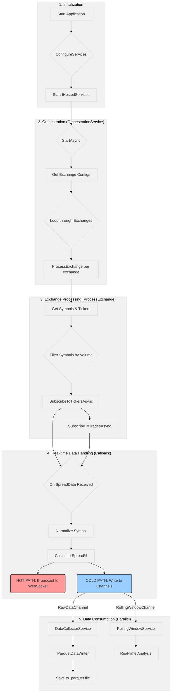

# Детальный поток выполнения проекта Collections (SpreadAggregator)

Этот документ описывает пошаговый поток данных и логику сервисов в приложении `SpreadAggregator`, основанный на анализе `OrchestrationService`. Обновлено: 2025-11-19

## Визуализация процесса



## 1. Запуск и инициализация (`StartAsync`)

**Файл:** [`OrchestrationService.cs:106`](collections/src/SpreadAggregator.Application/Services/OrchestrationService.cs:106)

### 1.1. Запуск WebSocket сервера
```csharp
_webSocketServer.Start();
```
**Цель:** Немедленная готовность к подключению клиентов для минимальной задержки.

### 1.2. Чтение конфигурации
```csharp
var exchangeNames = _configuration.GetSection("ExchangeSettings:Exchanges").GetChildren().Select(x => x.Key);
```
**Источник:** `appsettings.json` -> `ExchangeSettings:Exchanges`

### 1.3. Запуск обработчиков бирж
```csharp
foreach (var exchangeName in exchangeNames)
{
    var task = ProcessExchange(exchangeClient, exchangeName);
    tasks.Add(task);
    _exchangeTasks.Add(task);
}
```
**Паттерн:** Каждый exchange в отдельной асинхронной задаче для изоляции.

## 2. Обработка одной биржи (`ProcessExchange`)

**Файл:** [`OrchestrationService.cs:157`](collections/src/SpreadAggregator.Application/Services/OrchestrationService.cs:157)

### 2.1. Загрузка конфигурации volume filter
```csharp
var exchangeConfig = _configuration.GetSection($"ExchangeSettings:Exchanges:{exchangeName}:VolumeFilter");
var minVolume = exchangeConfig.GetValue<decimal?>("MinUsdVolume") ?? 0;
var maxVolume = exchangeConfig.GetValue<decimal?>("MaxUsdVolume") ?? decimal.MaxValue;
```

### 2.2. Получение информации о символах и тикерах
```csharp
var allSymbols = (await exchangeClient.GetSymbolsAsync()).ToList();
var tickers = (await exchangeClient.GetTickersAsync()).ToList();
```
**API calls:** Асинхронные вызовы к exchange API для получения списка инструментов и объемов торгов.

### 2.3. Фильтрация символов (многоэтапный процесс)
```csharp
var filteredSymbolInfo = allSymbols
    .Where(s => tickerLookup.ContainsKey(s.Name) &&
                (s.Name.EndsWith("USDT", StringComparison.OrdinalIgnoreCase) || s.Name.EndsWith("USDC", StringComparison.OrdinalIgnoreCase)) &&
                _volumeFilter.IsVolumeSufficient(tickerLookup[s.Name], minVolume, maxVolume))
    .ToList();
```

**Критерии фильтрации:**
- Символ должен заканчиваться на USDT или USDC
- Объем торгов должен соответствовать Min/Max USD Volume
- Символ должен присутствовать в ticker data

### 2.4. Подписка на потоки данных
```csharp
var enableTickers = _configuration.GetValue<bool>("StreamSettings:EnableTickers", true);
var enableTrades = _configuration.GetValue<bool>("StreamSettings:EnableTrades", true);

if (enableTickers)
{
    tasks.Add(exchangeClient.SubscribeToTickersAsync(filteredSymbolNames, async spreadData => {
        // HOT PATH обработка
    }));
}
```

## 3. Горячий путь: обработка Data Tick (Callback)

**Файл:** [`OrchestrationService.cs:203`](collections/src/SpreadAggregator.Application/Services/OrchestrationService.cs:203)

Это наиболее критическая секция кода по производительности, выполняется при каждом обновлении цены.

### 3.1. Получение данных
```csharp
var spreadData = // MarketData объект от exchange client
```

### 3.2. Нормализация и обогащение данных

**Файл:** [`OrchestrationService.cs:213-228`](collections/src/SpreadAggregator.Application/Services/OrchestrationService.cs:213-228)

```csharp
// Унифицированная нормализация символов
var normalizedSymbol = spreadData.Symbol
    .Replace("/", "")
    .Replace("-", "")
    .Replace("_", "")
    .Replace(" ", "");

// Добавление подчеркивания перед USDT/USDC
if (normalizedSymbol.EndsWith("USDT"))
{
    normalizedSymbol = normalizedSymbol.Substring(0, normalizedSymbol.Length - 4) + "_USDT";
}
else if (normalizedSymbol.EndsWith("USDC"))
{
    normalizedSymbol = normalizedSymbol.Substring(0, normalizedSymbol.Length - 4) + "_USDC";
}
```

**Цель:** Консистентность символов между различными биржами.

### 3.3. Создание SpreadData объекта
```csharp
var normalizedSpreadData = new SpreadData
{
    Exchange = spreadData.Exchange,
    Symbol = normalizedSymbol,
    BestBid = spreadData.BestBid,
    BestAsk = spreadData.BestAsk,
    SpreadPercentage = _spreadCalculator.Calculate(spreadData.BestBid, spreadData.BestAsk),
    MinVolume = minVolume,
    MaxVolume = maxVolume,
    Timestamp = timestamp,
    ServerTimestamp = spreadData.ServerTimestamp
};
```

### 3.4. HFT оптимизированное распределение данных

**Файл:** [`OrchestrationService.cs:247-263`](collections/src/SpreadAggregator.Application/Services/OrchestrationService.cs:247-263)

#### 3.4.1. HOT PATH: WebSocket broadcast (КРИТИЧНО для <1μs latency)
```csharp
// PROPOSAL-2025-0093: HFT hot path optimization
// HOT PATH: WebSocket broadcast FIRST (critical for <1μs latency)
var wrapper = new WebSocketMessage { MessageType = "Spread", Payload = normalizedSpreadData };
var message = JsonSerializer.Serialize(wrapper);
_ = _webSocketServer.BroadcastRealtimeAsync(message); // fire-and-forget
```

**Оптимизации:**
- Broadcast-first подход для минимальной задержки
- Fire-and-forget для неблокирующей отправки
- Минимальная сериализация JSON

#### 3.4.2. COLD PATH: Запись в независимые каналы
```csharp
// COLD PATH: TryWrite (synchronous, 0 allocations, ~50-100ns each)
// Preferred over WriteAsync for HFT - 20-100x faster, no blocking
if (!_rawDataChannel.Writer.TryWrite(normalizedSpreadData))
{
    Console.WriteLine($"[Orchestration-WARN] Raw data channel full (system overload), dropping spread data");
}

if (!_rollingWindowChannel.Writer.TryWrite(normalizedSpreadData))
{
    Console.WriteLine($"[Orchestration-WARN] Rolling window channel full (system overload), dropping spread data");
}
```

**ИСПРАВЛЕННАЯ АРХИТЕКТУРА (2025-11-19):**
- **RawDataChannel** - для DataCollectorService (сохранение в Parquet)
- **RollingWindowChannel** - для RollingWindowService (real-time анализ)
- **НЕ конкурирующие потребители** - каждый получает 100% данных
- **TryWrite синхронный** - ~50-100ns vs WriteAsync (1-10μs)

## 4. Потребители данных

### 4.1. DataCollectorService (Parquet запись)
**Читает из:** RawDataChannel  
**Ответственность:** Сохранение всех raw данных в Parquet файлы для последующего анализа

### 4.2. RollingWindowService (Real-time анализ)
**Читает из:** RollingWindowChannel  
**Ответственность:** Sliding window анализ для real-time insights

### 4.3. WebSocketServer (Direct broadcast)
**Получает данные:** Напрямую от OrchestrationService  
**Ответственность:** Немедленная трансляция всем подключенным клиентам

## 5. Обработка ошибок и восстановление

### 5.1. Graceful shutdown
**Файл:** [`OrchestrationService.cs:299`](collections/src/SpreadAggregator.Application/Services/OrchestrationService.cs:299)

```csharp
public async Task StopAsync(CancellationToken cancellationToken = default)
{
    Console.WriteLine($"[Orchestration] Stopping {_exchangeTasks.Count} exchange tasks...");

    // Give tasks a chance to complete gracefully
    var completedTask = await Task.WhenAny(Task.WhenAll(_exchangeTasks), Task.Delay(5000, cancellationToken));

    if (completedTask == Task.WhenAll(_exchangeTasks))
    {
        Console.WriteLine("[Orchestration] All tasks stopped gracefully");
    }
    else
    {
        Console.WriteLine("[Orchestration] Tasks did not complete in 5 seconds, forcing shutdown");
    }
}
```

### 5.2. Channel overflow handling
```csharp
if (!_rawDataChannel.Writer.TryWrite(normalizedSpreadData))
{
    Console.WriteLine($"[Orchestration-WARN] Raw data channel full (system overload), dropping spread data");
}
```

**Стратегия:** DropOldest policy + warning logging для мониторинга нагрузки.

## 6. Конфигурация и настройки

### 6.1. Exchange настройки
**Файл:** `SpreadAggregator.Presentation/appsettings.json`

```json
{
  "ExchangeSettings": {
    "Exchanges": {
      "Binance": { 
        "VolumeFilter": { "MinUsdVolume": 1000000, "MaxUsdVolume": 999999999 }
      },
      "Bybit": { 
        "VolumeFilter": { "MinUsdVolume": 500000, "MaxUsdVolume": 999999999 }
      }
    }
  }
}
```

### 6.2. Stream настройки
```json
{
  "StreamSettings": {
    "EnableTickers": true,
    "EnableTrades": true
  }
}
```

### 6.3. Channel настройки
**Файл:** [`Program.cs:87-90`](collections/src/SpreadAggregator.Presentation/Program.cs:87-90)

```csharp
var channelOptions = new BoundedChannelOptions(100_000)
{
    FullMode = BoundedChannelFullMode.DropOldest
};
```

**Параметры:**
- **Capacity:** 100,000 сообщений
- **Policy:** DropOldest при переполнении
- **Two channels:** RawDataChannel + RollingWindowChannel

## 7. Мониторинг и метрики

### 7.1. Console logging
- `[ExchangeName] Received {count} tickers`
- `[ExchangeName] {count} symbols passed volume filter`
- `[Orchestration-WARN] Raw data channel full`

### 7.2. Structured logging
**Файлы логирования:**
- Bid/Ask данные → `logs/bidask/`
- Chart данные → `logs/bidbid/`

## 8. Временные характеристики

### 8.1. Критические пути:
1. **Exchange → OrchestrationService:** < 1ms (network latency)
2. **OrchestrationService → WebSocket:** < 1μs (HFT optimized)
3. **OrchestrationService → Channels:** 50-100ns (TryWrite)
4. **Channels → Consumers:** Variable (зависит от обработки)

### 8.2. Bottlenecks:
- **Network latency** к exchange APIs
- **JSON serialization** для WebSocket broadcast
- **File I/O** для Parquet записи
- **Memory allocation** в горячем пути

## 9. Известные ограничения

### 9.1. Текущие:
- **Single OrchestrationService** - single point of failure
- **In-memory channels** - потеря данных при crash
- **O(N²) symbol pairing** - performance при большом количестве символов

### 9.2. Планируемые улучшения:
- **Distributed architecture** - multiple instances
- **Persistent queues** - Redis/PostgreSQL
- **Stream processing** - Apache Kafka/Flink
